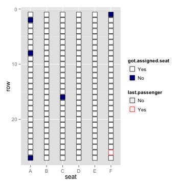
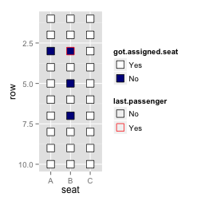
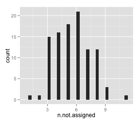

## The question

Everyone on an airplane has been 
assigned a seat. 

The first person to enter, rascal that he is, sits at random
in the airplane instead of finding his seat (although he may randomly sit
where he's supposed to!). 

For all the rest of the passengers to board, 
if their assigned seat is available, they will sit there. Otherwise, they 
will choose a random seat from the ones that are still empty. 

We want to know
the probability that the last person to board will end up in the seat 
originally assigned to him. 

(Source of question : [Paul J. Nahin](http://www.amazon.com/Will-You-Alive-Years-Now/dp/0691156808/ref=sr_1_1?ie=UTF8&qid=1404938362&sr=8-1&keywords=will+you+be+alive))

## Basic steps

To solve this problem, we will: 

- [Figure out a way in R to simulate the airplane filling](https://github.com/geanders/test-repo/blob/master/Week1_RProgramming/SingleAirplaneSimulation.R)
- [Put that code into a function](https://github.com/geanders/test-repo/blob/master/Week1_RProgramming/AirplaneSimulationFunction.R)
- [Run the function a lot of times and see how often the last person gets his seat](https://github.com/geanders/test-repo/blob/master/Week1_RProgramming/MultipleAirplaneSimultations.R)

## Simulating the airplane filling

Let's think about how we can break down the code to simulate the airplane filling:

- Create a list of all the seats on the airplane
- Randomly assign passengers to seats
- Determine each passenger's actual seat (random for first person, for everyone else: assigned if that seat is still free, otherwise random)

## List of seats on the airplane

For example, if the airplane has 27 rows and 6 seats in each row (seats A--F):


```r
head(available.seats, 50)
```

```
##  [1] "1A"  "2A"  "3A"  "4A"  "5A"  "6A"  "7A"  "8A"  "9A"  "10A" "11A"
## [12] "12A" "13A" "14A" "15A" "16A" "17A" "18A" "19A" "20A" "21A" "22A"
## [23] "23A" "24A" "25A" "26A" "27A" "1B"  "2B"  "3B"  "4B"  "5B"  "6B" 
## [34] "7B"  "8B"  "9B"  "10B" "11B" "12B" "13B" "14B" "15B" "16B" "17B"
## [45] "18B" "19B" "20B" "21B" "22B" "23B"
```

```r
length(available.seats)
```

```
## [1] 162
```

## Randomly assign passengers to seats


```r
head(manifest)
```

```
##   passenger assigned.seat row seat
## 1         1            1F   1    F
## 2         2           24A  24    A
## 3         3           21B  21    B
## 4         4           21C  21    C
## 5         5           24F  24    F
## 6         6           15E  15    E
```

```r
nrow(manifest)
```

```
## [1] 162
```

## Determine each person's actual seat

First, create a vector of seat availability that you can change as people get seats: 


```r
head(seat.availability, 20)
```

```
##    1A    2A    3A    4A    5A    6A    7A    8A    9A   10A   11A   12A 
## Empty Empty Empty Empty Empty Empty Empty Empty Empty Empty Empty Empty 
##   13A   14A   15A   16A   17A   18A   19A   20A 
## Empty Empty Empty Empty Empty Empty Empty Empty 
## Levels: Empty Taken
```

```r
seat.availability["10A"]
```

```
##   10A 
## Empty 
## Levels: Empty Taken
```

## Determine each person's actual seat

Next, go through each passenger and give them their seat based on the boarding rules (randomly pick a seat for the first person, then for everyone else, they get their assigned seat if it's free and otherwise get a random seat):


```r
manifest[1:5, c(1, 2, 5, 6)]
```

```
##   passenger assigned.seat actual.seat got.assigned.seat
## 1         1            1F         16C                No
## 2         2           24A         24A               Yes
## 3         3           21B         21B               Yes
## 4         4           21C         21C               Yes
## 5         5           24F         24F               Yes
```

## Result of one simulation

 

## Create a function to run the simulation


```r
fill.airplane(rows = 10, seats = 3, plot.airplane = TRUE)
```

 

```
##   n.not.assigned last.got.assigned
## 1              4                No
```

## Run the simulation

Run the simulation 100 times for an airplane with 27 rows, 6 seats per row. How often did the last person get his assigned seat? How many people did not get their assigned seats?


```r
head(sim.1, 3)
```

```
##   n.not.assigned last.got.assigned
## 1              6                No
## 2              4                No
## 3              8                No
```

```r
table(sim.1$last.got.assigned)
```

```
## 
##  No Yes 
##  51  49
```

## Run the simulation


```r
ggplot(sim.1, aes(x = n.not.assigned)) + geom_histogram()
```

 

