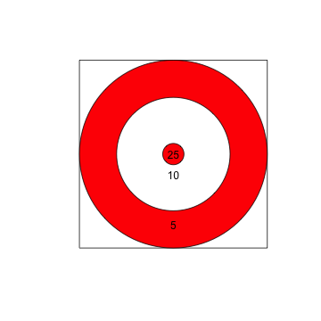
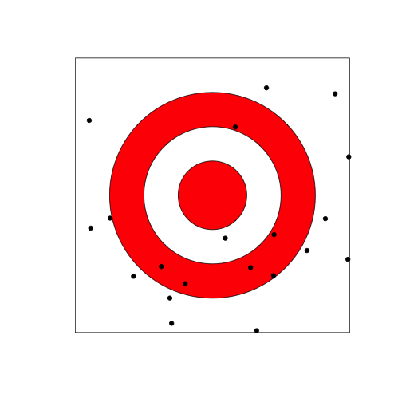
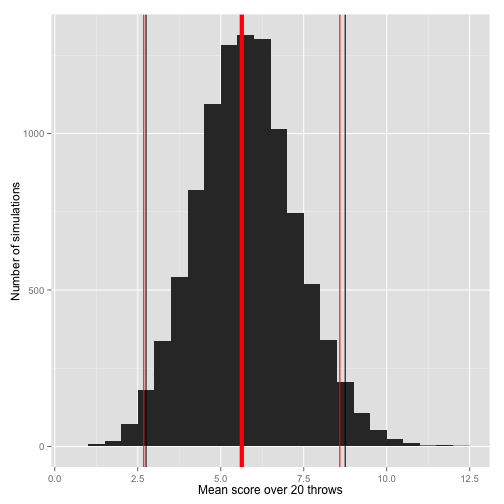
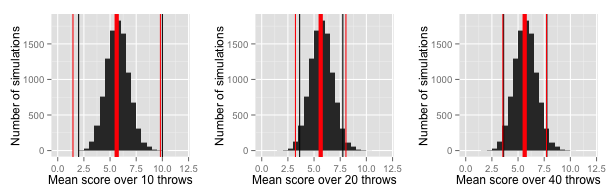

## Playing darts

**Research question: Is a person skilled at playing darts?**

Here's our dart board-- the numbers are the number of points you win for a hit in each area.



## Null hypothesis

First, what would we expect to see if the person we test has no skill at playing darts? 

*Questions for you:*

- *What would the dart board look like under the null (say the person throws 20 darts for the experiment)?*
- *About what do you think the person's mean score would be if they had no skill at darts?*
- *What are some ways to estimate or calculate the expected mean score under the null?*

## Graph of results under the null

Let's use R to answer the first question: what would the null look like?

First, create some random throws (the square goes from -1 to 1 on both sides):


```r
n.throws <- 20
throw.x <- runif(n.throws, min = -1, max = 1)
throw.y <- runif(n.throws, min = -1, max = 1)
head(cbind(throw.x, throw.y))
```

```
##          throw.x    throw.y
## [1,]  0.89347717  0.7394530
## [2,] -0.29797507 -0.9337803
## [3,]  0.09359793 -0.3127252
## [4,]  0.44484651 -0.5858662
## [5,]  0.32203530 -0.9870616
## [6,] -0.89805189  0.5453006
```

## Graph of results under the null


```r
plot(c(-1, 1), c(-1,1), type = "n", asp=1,
     xlab = "", ylab = "", axes = FALSE)
rect( -1, -1, 1, 1) 
draw.circle( 0, 0, .75, col = "red")
draw.circle( 0, 0, .5, col = "white")
draw.circle( 0, 0, .25, col = "red")
points(throw.x, throw.y, col = "black", pch = 19)
```

 

## Mean score under the null

Next, let's tally up the score for this simulation of what would happen under the null.

To score each throw, we calculate how far the point is from (0, 0), and then use the following rules: 

- **20 points**: $0.00 \le \sqrt{x^2 + y^2} \le .25$
- **15 points**: $0.25 < \sqrt{x^2 + y^2} \le .50$ 
- **10 points**: $0.50 < \sqrt{x^2 + y^2} \le .75$ 
-  **0 points**: $0.75 < \sqrt{x^2 + y^2} \le 1.41$ 

## Mean score under the null

Use these rules to "score" each random throw:


```r
throw.dist <- sqrt(throw.x^2 + throw.y^2)
head(throw.dist)
```

```
## [1] 1.1597811 0.9801708 0.3264317 0.7356138 1.0382665 1.0506426
```

```r
throw.score <- cut(throw.dist,
                   breaks = c(0, .25, .5, .75, 1.5),
                   labels = c("20", "15", "10", "0"),
                   right = FALSE)
head(throw.score)
```

```
## [1] 0  0  15 10 0  0 
## Levels: 20 15 10 0
```

## Mean score under the null

Now that we've scored each throw, let's tally up the total:


```r
table(throw.score)
```

```
## throw.score
## 20 15 10  0 
##  0  1  6 13
```

```r
mean(as.numeric(as.character(throw.score)))
```

```
## [1] 3.75
```

## What to expect under the null

So, this just showed *one* example of what might happen under the null. If we had a lot of examples like this (someone with no skill throwing 20 darts), what would we expect the mean scores to be?

*Questions for you:*

- *How can you figure out the expected value of the mean scores under the null (that the person has no skill)?*
- *Do you think that 20 throws will be enough to figure out if a person's mean score is different from this value, if he or she is pretty good at darts?*
- *What steps do you think you could take to figure out the last question?*
- *What could you change about the experiment to make it easier to tell if someone's skilled at darts?*

## What to expect under the null

How can we figure this out?

- **Theory.** Calculate the expected mean value using the expectation formula
- **Simulation.** Simulate a lot of examples using R and calculate the mean of the mean score from these.

## Calculating $E[X]$

The expected value of the mean, $E[\bar{X}]$, is the expected value of $X$, $E[X]$. To calculate the expected value of $X$, use the formula:

$$ E[X] = \sum_x xp(x)$$
$$ E[X] = 20 * p(X = 20) + 15 * p(X = 15) +\\ 10 * p(X = 10) + 0 * p(X = 0)$$

So we just need to figure out $p(X = x)$ for $x = 20, 15, 10$.

## Calculating $E[X]$

(In all cases, we're dividing by 4 because that's the area of the full square, $2^2$.)

- $p(X = 20)$: Proportional to area of the smallest circle, $(\pi * 0.25^2) / 4 = 0.049$
- $p(X = 15)$: Proportional to area of the middle circle minus area of the smallest circle, $\pi(0.50^2 - 0.25^2) / 4 = 0.147$
- $p(X = 10)$: Proportional to area of the largest circle minus area of the middle circle, $\pi(0.75^2 - 0.50^2) / 4 = 0.245$
- $p(X = 0)$: Proportional to area of the square minus area of the largest circle, $(2^2 - \pi * 0.75^2) / 4 = 0.558$

As a double check, if we've done this write, the probabilities should sum to 1:

$$0.049 + 0.147 + 0.245 + 0.558 = 0.999$$

## Calculating $E[X]$

$$ E[X] = \sum_x xp(x)$$
$$ E[X] = 20 * 0.049 + 15 * 0.147 +\\ 10 * 0.245 + 0 * 0.558$$
$$ E[X] = 5.635 $$

Remember, this also gives us $E[\bar{X}]$.

## Calculating $var(X)$ and $var(\bar{X})$

Now it's pretty easy to also calculate $var(X)$ and $var(\bar{X})$:

$$
Var(X) = E[(X - \mu)^2] = E[X^2] - E[X]^2
$$ 

$$
E[X^2] = 20^2 * 0.049 + 15^2 * 0.147 +\\ 10^2 * 0.245 + 0^2 * 0.558 = 77.18
$$

$$
Var(X) = 77.175 - (5.635)^2 = 45.42
$$

$$
Var(\bar X) = \sigma^2 / n = 45.42 / 20 = 2.27
$$

## Calculating CI for $\bar{X}$

Now that we can use the Central Limit Theorem to calculate a 95% confidence interval for the mean score when someone with no skill (null hypothesis) throws 20 darts:


```r
5.635 + c(-1, 1) * qnorm(.975) * sqrt(2.27)
```

```
## [1] 2.682017 8.587983
```

## Simulating $E[\bar{X}]$ and $Var(\bar{X})$

We can check our math by running simulations-- we should get the same values of $E[\bar{X}]$ and $Var(\bar{X})$ (which we can calculate directly from the simulations using R).


```r
n.throws <- 20
n.sims <- 10000

x.throws <- matrix(runif(n.throws * n.sims, -1, 1),
                   ncol = n.throws, nrow = n.sims)
y.throws <- matrix(runif(n.throws * n.sims, -1, 1),
                   ncol = n.throws, nrow = n.sims)
dist.throws <- sqrt(x.throws^2 + y.throws^2)
score.throws <- apply(dist.throws, 2, cut,
                   breaks = c(0, .25, .5, .75, 1.5),
                   labels = c("20", "15", "10", "0"),
                   right = FALSE)
```

## Simulating $E[\bar{X}]$ and $Var(\bar{X})$


```r
dist.throws[1:3,1:5]
```

```
##           [,1]      [,2]      [,3]      [,4]      [,5]
## [1,] 0.6473413 1.1655720 0.7391376 0.7272417 1.2804002
## [2,] 0.6538102 0.8878309 1.0340123 0.9607072 0.8998138
## [3,] 0.7252964 0.7833082 0.5441149 0.9788909 1.0037519
```

```r
score.throws[1:3,1:5]
```

```
##      [,1] [,2] [,3] [,4] [,5]
## [1,] "10" "0"  "10" "10" "0" 
## [2,] "10" "0"  "0"  "0"  "0" 
## [3,] "10" "0"  "10" "0"  "0"
```

## Simulating $E[\bar{X}]$ and $Var(\bar{X})$


```r
mean.scores <- apply(score.throws, MARGIN = 1,
                     function(x){
                             out <- mean(as.numeric(
                                     as.character(x)))
                             return(out)
                     })
head(mean.scores)
```

```
## [1] 5.25 3.75 6.50 7.25 6.75 4.75
```

## Simulating $E[\bar{X}]$ and $Var(\bar{X})$



## Simulating $E[\bar{X}]$ and $Var(\bar{X})$

Let's check the simulated mean and variance against the theoretical values:


```r
mean(mean.scores) ## Theoretical: 5.635
```

```
## [1] 5.653625
```

```r
var(mean.scores) ## Theoretical: 2.27
```

```
## [1] 2.254981
```

## Testing against null

*Questions for you:*

- *How high of a mean score would someone need to get for us not to chalk it up to chance? In other words, how high would someone's mean score need to be after 20 throws for us to reject the null that he or she is unskilled?*
- *Do you think this experiment is powerful enough to detect a skilled darts player from a practical point of view? (Related: What is the difference in this experiment between statistical and practical significance?)*
- *If not, what would you change about the experiment?*
- *If you think that this experiment is more than powerful enough, how could you improve the experiment design?* 

## Testing against the null


